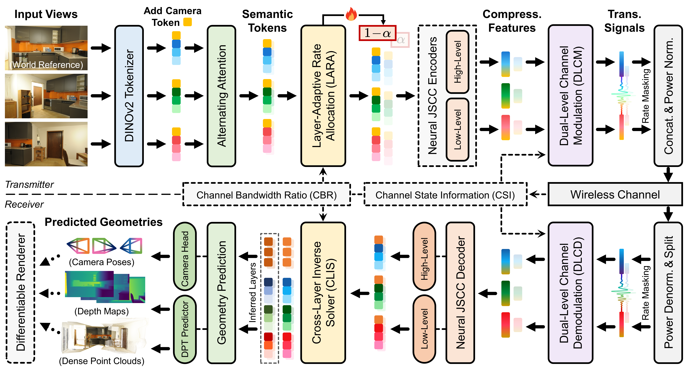

<div align="center">

# VGTT: Feed-Forward Visual Geometry Token Transmission<br>for 6G Immersive Communication

[](https://arxiv.org/abs/2605.xxxxx)
[](https://www.comsoc.org/publications/journals/ieee-jsac)
[](https://qin-jingyun.github.io/VGTT)
[](LICENSE)
[](mailto:hailong.qin@bupt.edu.cn)

[Hai-Long Qin](https://scholar.google.com/citations?user=N33wbdEAAAAJ)¹, [Jincheng Dai](https://scholar.google.com/citations?user=0I_YtFsAAAAJ)¹, [Sixian Wang](https://scholar.google.com/citations?user=f9s8H6UAAAAJ)², [Guo Lu](https://scholar.google.com/citations?user=R9iwlJcAAAAJ)², [Lei Luo](https://scholar.google.com/citations?user=jvrxePoAAAAJ)³,  
[Ce Zhu](https://scholar.google.com/citations?user=C7iZbYMAAAAJ)⁴, [Wenjun Zhang](https://ieeexplore.ieee.org/author/37278428800)², [Ping Zhang](https://ieeexplore.ieee.org/author/37274503400)¹

¹ Beijing University of Posts and Telecommunications (BUPT)  
² Shanghai Jiao Tong University (SJTU)  
³ Chongqing University of Posts and Telecommunications (CQUPT)  
⁴ University of Electronic Science and Technology of China (UESTC)

</div>

<div align="justify">

## 📢 News

This work is currently under review. After the paper is accepted, we will progressively release the source code under the MIT License, free for community developers to use and build on.

## ⚡ TL;DR

We propose **VGTT**, a wireless 3D delivery paradigm for 6G immersive communication. Instead of sending raw 3D primitives or compressed 2D views, VGTT transmits geometry-aware semantic tokens distilled by cross-view spatial reasoning.

- **Unified Token Representation**
  Tokens distilled at the transmitter serve multiple 3D attributes, so the receiver predicts depth maps, point clouds, and camera poses in a single feed-forward pass.
- **Channel-Aware JSCC Design**
  Three components, LARA, DLCM, and CLIS, built on a neural joint source-channel codec, handle bandwidth allocation, channel protection, and feature recovery end to end.
- **Dual-Level Transmission**
  Geometric semantics and spatial detail are sent as two complementary levels, carried by a deep token anchor and a shallow token anchor.

In short, VGTT trades off bandwidth, latency, and fidelity while keeping channel robustness and task versatility, as a foundation for closed-loop digital twin networks.

</div>

<p align="center">
  
</p>

<div align="justify">

## 📖 Abstract

Synchronizing the 3D physical world with its digital counterpart is a core real-to-sim task of digital twin networks (DTNs) for 6G immersive communication. To build such a twin, the receiver needs several geometric attributes that downstream 3D tasks use together. Existing methods separate the representation and the transmission of these attributes: the occupancy-unit paradigm sends raw 3D primitives in one fixed format such as point clouds, while the pixel-feature paradigm sends compressed 2D views without conveying geometry and leaves the receiver to recover it. **We propose Visual Geometry Token Transmission (VGTT), a paradigm that transmits geometry-aware semantic tokens as a unified representation**, distilled through cross-view spatial reasoning at the transmitter, and predicts multiple 3D attributes from these tokens at the receiver in a single feed-forward pass. Under bandwidth and channel constraints, VGTT treats geometric semantics and spatial detail as two complementary levels and integrates three channel-aware components, LARA, DLCM, and CLIS, built on neural joint source-channel coding, to handle bandwidth allocation, channel protection, and feature recovery end to end. Experiments show that VGTT holds a bandwidth, latency, and fidelity trade-off while keeping channel robustness and task versatility, **offering a scalable foundation for closed-loop DTNs in 6G immersive communication.**

## 📝 Citation

If you find this work helpful, please consider citing:

```bibtex
@article{qin-vgtt,
    title   = {VGTT: Feed-Forward Visual Geometry Token Transmission for 6G Immersive Communication},
    author  = {Qin, Hai-Long and Dai, Jincheng and Wang, Sixian and Lu, Guo and Luo, Lei and Zhu, Ce and Zhang, Wenjun and Zhang, Ping},
    journal = {arXiv preprint arXiv:2605.xxxxx},
    year    = {2026}
}
```

</div>
